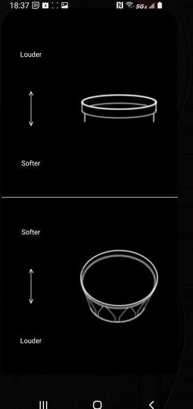

# Finger Perc

Screen recording of app: 

This app is a playable musical instrument. It is packaged with a set of 300+ audio samples
(expandable) which are individually triggered when a user touches various zones on the screen. 
Those samples are recordings of two different percussion instruments: 1) Bombo Legüero, a 
traditional Andean folk music drum typically made of 
wood and alpaca skins or cowhide 2) Cajón Flamenco, the popular Spanish variation of a box drum, 
containing snares.  

For each instrument, there are two zones on the screen which represent the primary sounds that the 
instrument can make. 
In the case of the Bombo Legüero, those two sounds are 1) a hit on the wooden rim of the drum and 2) 
a hit in the center of the drum head (membrane, that is). 
With the Cajón Flamenco, the two sounds are 1) a hit on the top edge and 2) a hit in the front center. 
Each of those two zones has many subzones, generated automatically based on the provided sample set. 
Each sub-zone corresponds to a different volume for that articulation. 
While that is the deepest level of detail that the user can control, there is another 
layer of depth to the sample set, which is controlled by programming logic. 
Each volume of each articulations is accompanied by a set 
(between 5-10 audio files) of repetitions of the same sound. Those samples are called 
"Round Robins" and are intended to add human imperfections to repeated notes, thus avoiding the
dreaded "machine gun effect". 

The first test build of the app is complete and has been released for internal testing. 

See the documentation for useful diagrams of the architecture (not completely up to date, but still 
demonstrate how things work).
