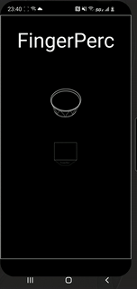

# Bombo Legüero - Finger Perc

This app is a playable musical instrument. It is packaged with a set of ±150 audio samples (can be modified) which are individually triggered when a user touches a corresponding zone on the screen. 
There are ±20 zones on the screen (generated based on the provided sample set). 
See the documentation for useful diagrams of the architecture. 
