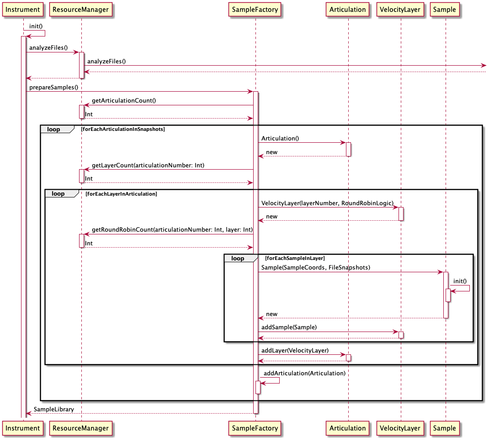
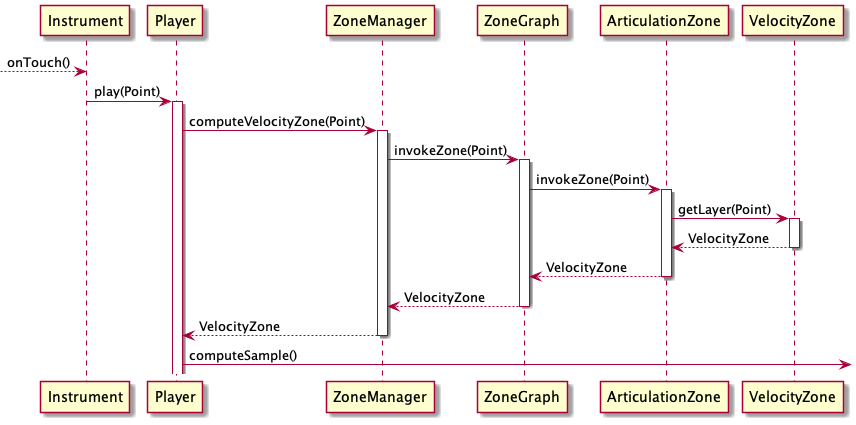
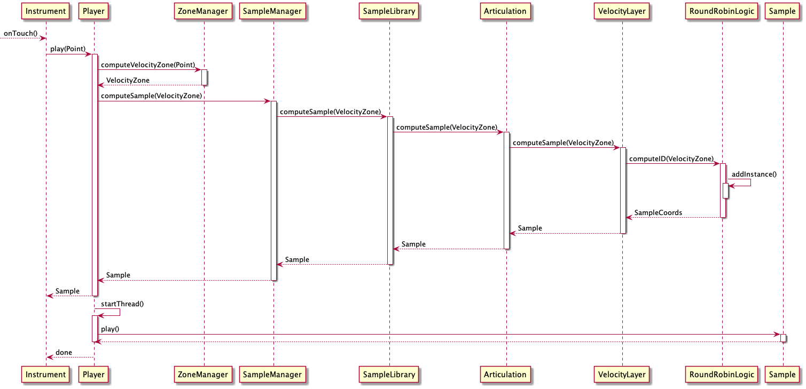

# Diagrams

These are some diagrams and explanations to give you an idea of what problems the app has to solve and how it goes about addressing them.

The interface of the instrument is designed according to what a human hand can do, and 
attempts to reintroduce control of dynamics, in spite of the nature of touchscreens. 
It achieves it by first assigning a zone of the touchscreen to a specific type of sound from 
the sampled instrument (an articulation), and then using the space within that zone to control 
volume (velocity). Decisions about orientation were made based on experimentation with a set of 
popular rhythms and idiomatic embellishments, settling for the one where these can be 
produced with the greatest ergonomics in the hand.

The audio samples are stored in the assets directory. At present, 
they are around 300 samples. 
That consists of multiple instruments, multiple articulations per instrument, 
multiple velocity layers per articulation, and multiple round robins per velocity
layer. 

### Problem 1

The numbers of samples fluctuate as I remove problematic samples or add new ones. 
Additionally, I expect to add more instruments, with varying levels of sampling depth.
The app must be loosely coupled enough with the sample set that any amount of any 
layer will not cause problems. I name the files according to a specific schema, which I 
can adhere to, but if I delete a round robin, subsequent round robins will have incorrect 
numbers. The app needs to deal with that. 

### Problem 2

The screen will need to create zones for whatever samples I give it.

### Problem 3

The audio needs to have very low latency. The lower the latency, the better the music, simple as that.

## Solution

### The preparation sequence

First, the ResourceManager class is tasked with analyzing the audio resources provided. It exposes 
functions that other classes can call to get information about these resources.

The first class to call those functions is the ZoneFactory, which, based on that data, 
will create a set of zones, one for each velocity layer of each articulation. The classes in the 
<code>zone</code> package will be in charge of managing the coordinatates of those zones. Other classes 
in the app will interact with these classes through the ZoneManager class.

This diagram shows the creation of zones, based on the audio resources allocated.

The app then creates a structure to reflect the files provided. These classes are found in the 
<code>sample</code> package, and are in charge of associating 
information about each audio asset to a specific object in the <code>zone</code> package. Other classes 
in the app will interact with these classes through the SampleManager class.

This diagram shows the creation of the sample objects, based on the audio files provided:

### Player service

Once that data is ready, the <code>Player</code> service can be prepared. In this case, I'm calling
the oboe library from google, a C++ library that wraps SL ES and AAudio. A stream is setup and started, 
and the audio data is loaded, ready to trigger. 

### The play sequence

When a user touches the screen, the player service needs to find a specific audio resource out of the 
entire set, and play it back. 

First, the touch event needs to be filtered by the TouchLogic service. If it passes, the coordinates 
need to be passed to the ZoneManager which determines which articulation and velocity that point
signifies. It will return a <code>VelocityZone</code> object. 

The SampleManager stores associations of <code>VelocityZone</code> objects to <code>VelocityLayer</code>
objects, so it can receive an instance of the prior and return an instance of the latter. This diagram 
shows how it does that. 

Finally, the <code>Player</code> service can be provided with that resource for playback!
